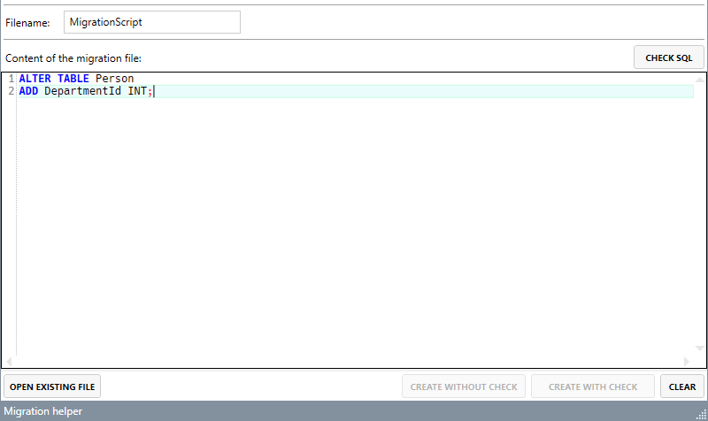

# Migration Helper

**Content**
<!-- TOC -->

- [Migration Helper](#migration-helper)
    - [History](#history)
    - [General](#general)
    - [Usage](#usage)
        - [First use](#first-use)
        - [Create migration script](#create-migration-script)
        - [Edit migration script](#edit-migration-script)
    - [Analyze errors](#analyze-errors)

<!-- /TOC -->

## History
| Version | Date | Created / Edit by |
|---|---|---|
| 1.2.0 | 2019-04-07 | A. Pouwels |

## General
The *Migration Helper* is a small tool to create migration script for projects which uses the migration project [dbup](https://dbup.github.io).

## Usage

### First use
When you start the migration helper for the first time, some settings have to be made:

1. **Project file**: Add the path of the migration project file.
2. **Script dir**: Add the name of the script directory (if you don't have a separate direcotry for the scripts, leave the field blank).

### Create migration script

1. Add the name of the migration script (*Filename*)
2. Add the sql query or use an existing script file (*Open existing file*)

Now you have the following three options:
1. **Check sql**: Parses the sql script and checks it for errors (this method uses the MS SQL parser)
2. **Create without check**: Creates the migration script without a check for errors.
3. **Create with check**: Checks the script for errors. If the script doesn't contain any errors, the migration script will be create.
4. **Clear**: Clears the filename and the editor.

### Edit migration script

If you want to edit an existing migration script you can select it from the right. All migration scripts which are stored in the given directory (*Script dir*) will be shown on the right.

## Analyze errors
If your script contains errors they will be shown under the editor:

You can perform a double click on the error and the cursor in the editor will jump to the desired position.