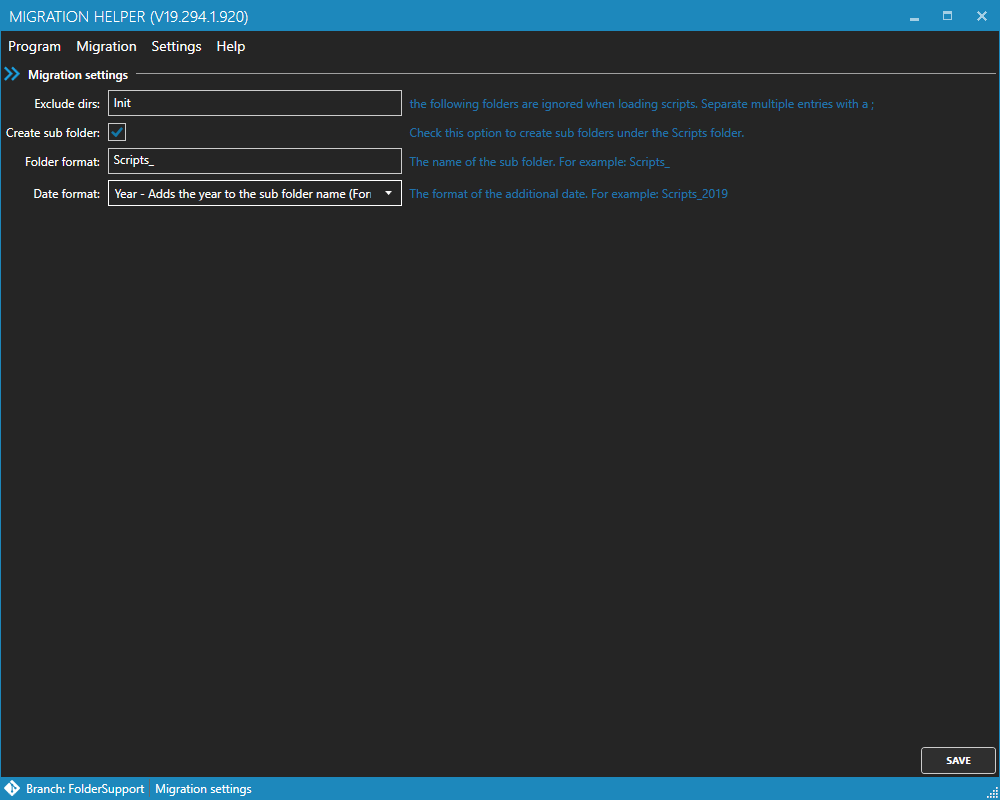

# Migration Helper

**Content**
<!-- TOC -->

- [History](#history)
- [General](#general)
- [Usage](#usage)
    - [First use](#first-use)
    - [Buttons](#buttons)
    - [Create a new migration script](#create-a-new-migration-script)
    - [Edit migration script](#edit-migration-script)
    - [Analyze errors](#analyze-errors)
- [Settings menu](#settings-menu)
- [Help menu](#help-menu)

<!-- /TOC -->

## History
| Version | Date | Created / Edit by |
|---|---|---|
| 1.0 | 2019-04-07 | A. Pouwels |
| 1.1 | 2019-10-21 | A. Pouwels |
| 1.2 | 2020-02-26 | A. Pouwels |

## General
The *Migration Helper* is a small tool to create migration script for projects which uses the migration project [dbup](https://dbup.github.io).

## Usage

### First use
When you start the migration helper for the first time, some settings have to be made:

1. **Project file**: Add the path of the migration project file.
2. **Script dir**: Add the name of the script directory (if you don't have a separate direcotry for the scripts, leave the field blank).

### Buttons

On the UI, you will find the following buttons:
- Migration window

    1. *New*: Creates a new migration file
    2. *Open*: Opens an existing sql file
    3. *Check*: Checks the inserted sql script.
    4. *Clean*: Removes the inserted sql script
    5. *Save*: Saves the current sql script

- Navigation:

    6. *Open*: Opens the selected script
    7. *Delete*: Deletes the selected script

- Settings:

    8. *Open*: Opens a migration project

### Create a new migration script

1. Add the name of the migration script (*Filename*)
2. Add the sql query or use an existing script file (*Open existing file*)

### Edit migration script
If you want to edit an existing migration script you can select it from the right. All migration scripts which are stored in the given directory (*Script dir*) and included into the project will be shown on the right.

### Analyze errors
If your script contains errors they will be shown under the editor:

You can perform a double click on the error and the cursor in the editor will jump to the desired position.

## Settings menu
Under *Settings* you will find the following settings:

The settings contains the following options:
- *Exclude dirs*: Enter the directories which should ignored during the loading process. You can add multiple names separated by a "**;**"
- *Create sub folder*: If you choose this option, every script will be stored in a separate sub directory.
- *Folder format*: Enter the name of the sub folder (only available when *Create sub folder* is selected)
- *Date format*: If you want to add a date to the sub folder, select the desired option (only available when *Create sub folder* is selected). Following options are available:
   - *None*: Nothing will be added
   - *Year*: The year (Format `yyyy`) will be added. For example: `Scripts_2019`
   - *YearAndMonth*: The year and the month (Format `yyyyMM`) will be added. For example: `Scripts_201910`

## Help menu

The help menu contains the following items:
1. *Appearance*: Opens a dialog where you can switch the appearance of the windows
2. *Manual*: Opens this document
3. *About*: Opens a dialog with some information about the tool