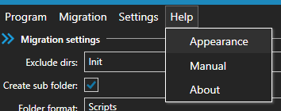

# MigrationHelper

When you use [dbup](https://dbup.github.io) you can use this small tool to add a new migration script to you migration project without opening visual studio.

## Usage
### Preparations
Open the tool and add the path to you migration project and the name of the script directory (if exists, otherwise leave it empty).

- Project file: The path of your migration project
- Script dir: The name of your script direcotry (leave it blank if you don't have a special folder for the scripts)

### New migration script
To create a new migration script, add the name of the script (*Filename:*) and the content of the script (you can open an existing file via *Open existing file*).

When you've entered a file name and the sql query you've the following options:
- Check SQL: Checks the script for errors
- Create without check: Creates a new migration script without checking the sql query
- Create with check: Creates a new migration script with a check. If the check fails the process will be stopped.

### Error analysis
If you have performed the check and have and error you will get further information (under the editor) about the error:

